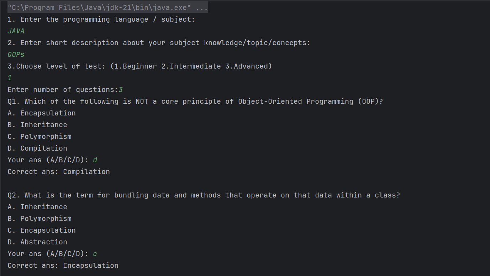

# QuizMind 🧠

QuizMind is a Java-based console application that helps users take customized programming and non programming quizzes. The app uses **Google Gemini AI** to dynamically generate multiple-choice questions (MCQs) based on the user's selected subject, topic, and difficulty level.

### ✨ Features

- AI-generated quiz questions using Google Gemini (free-tier support).
- Customizable test settings (language/topic/difficulty).
- Interactive console quiz experience.
- Score and summary at the end of the test.
- Reads/writes questions in strict JSON format.
- Modular code with clean architecture and utility classes.

---

## 🏗️ Project Structure

- com.QuizMind.Main # Entry point
- com.QuizMind.Model # Contains Questions class
- com.QuizMind.Service # Communicates with Gemini API
- com.QuizMind.Logic # Handles quiz flow and logic
- com.QuizMind.Utils # File I/O and JSON parsing utilities

---

## 🏃‍➡️ How to run on your local system

### 🔧 Prerequisites

1. **Java JDK 17+**
2. **Internet connection** (for Gemini API)
3. A Google Cloud project with [Gemini API](https://console.cloud.google.com/) access 
4. Set environment variable
   - Set: GOOGLE_API_KEY = **Your API KEY**

---

### 📃 Sample outputs

---